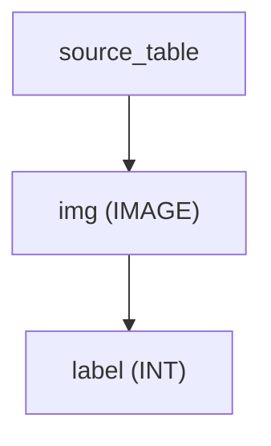
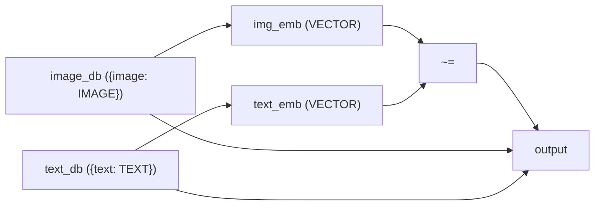
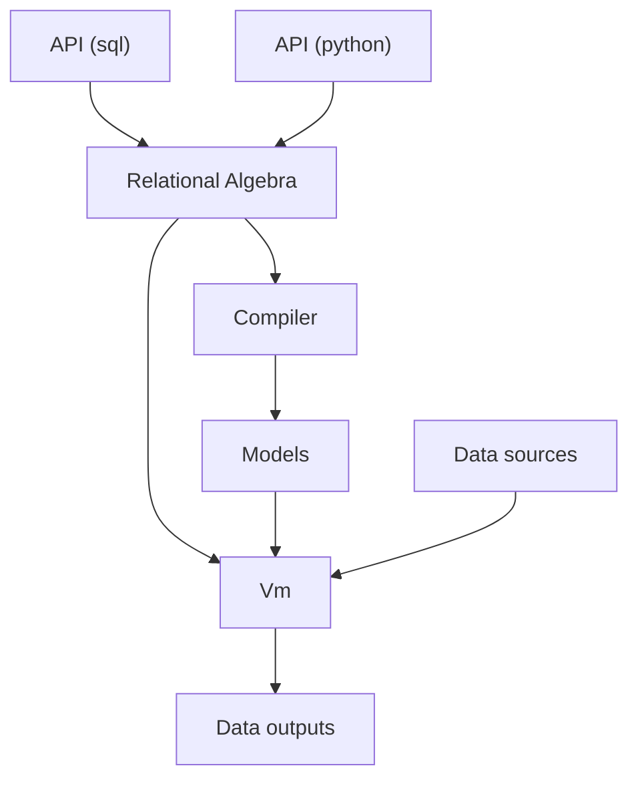
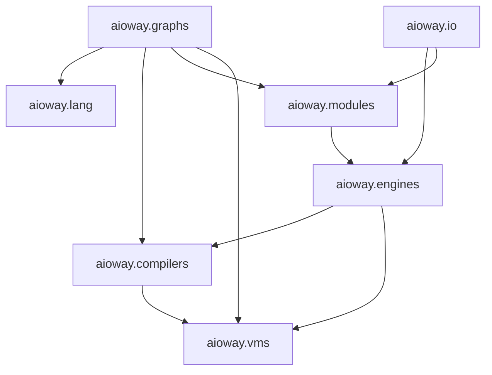

# AioWay

## 🤔 Why Aioway

In the recent years, machine learning's entry barrier has gotten higher, rather than lower. With the increasing number of algorithms and libraries and models, it's no wonder qualified data scientists are rare because you would need years of training to keep up to the status quo.

We designed Aioway in a way such that instead of thinking about **how** to do ML, you specify **what** to do. Instead of focusing on what algorithms and models to use, Aioway allows you to focus on the use cases by taking into account the context of the problem, and perform compliation according to the data to ensure good performance. Automatically.

## 🍰 Aioway's features

- Aioway looks just like SQL. No need to learn another langauge.
- Aioway's compiler would automatically detect the task at hand and use the best models and algorithms automatically.
- Aioway allows you to quickly tune the underlying model, or specify constraints so that the runtime uses your computational resources wisely.
- Aioway allows users to easily plug in their own code (PyTorch code) whenver the provided utility is not satisfactory.

## 🍳 Getting started

Aioway is a compiler and streaming engine for a SQL-like language. The language is essentially SQL with types:

```sql
-- source_table is a image data source
-- A casting (type conversion is a ML model)
COMPUTE {label: INT} FROM source_table;
```

Equivalent code in Python:

```python
from aioway import *

img = Data.create(Dict({"img": Primitive.IMAGE}))
label = img.transform(Dict({"label": Primitive.INT}))
```

This would create a computational graph as follows:



Here, the `img -> label` transformation would automatically create a machine learning model. Aioway compiler is smart and would create a suitable model based on the context.

The comments in the SQL code are _compiler hints_ that would allow users for more finetuned control.

Here's an example of a simple retrieval model (retrieve images and texts, and apply captioning):

```sql
-- Converts both to embeddings (a vector)
SELECT image_db.image,
       text_db.text,
       CAST(image_db.image, VECTOR) AS image_emb,
       CAST(text_db.text, VECTOR) AS text_emb
FROM image_db
JOIN text_db
-- Here ~= denotes almost equal, which would conduct a similarity search.
WHERE image_emb ~= text_emb;
```

The example represented by the above query would be



Where you are converting both sources to a common foramt (embeddings), then match them based on similarity.
Note that we did not mention image dimension, text length, or embedding size.
They are not needed. They are taken care of automatically by Aioway.


## 🏋️ How Aioway works

The prominant way of doing machine learning is using libraries. Using `transformers` would give you a transformer, and `scikit-learn` (`sklearn`) would give you various different ML models.

_However, most of the time we don't actually care about which algorithms to use, rather than the algorithms do their job and give you good performance._

We realized that this is exactly what SQL and relational algebra is trying to solve. Instead of having to tell databases how to do things, it just does it. Therefore, Aioway leverages the power of relational algebra by extending SQL with types: everything else still operates in the same way, except you can type-cast to different formats (such as `IMAGE`, `TEXT`, `AUDIO` etc), and those casting operations are backed by machine learning models, and trained based on your data.

## ✏️ Design of Aioway

Aioway is intentionally designed to be flexible, due to uncertainty and my lack of expertise in what the optimal design is (to be fair, this is a new field so probably no one knows). Therefore, aioway is very modular, and tries to be compatible with all possible good designs s.t. different designs can be realized (without significant refactors) at a later time.

## 📖 Under the hood

Aioway does the following:

1. Convert the language level (API level) syntax tree into a flow graph
2. Optimize the flow graph, and then compile them into models. The compilation process would take into account the input / output format and the resources used by each model. 
3. Send the models into our runtime (Vm), which is responsible for running and connecting data sources and targets.
4. If needed, Vm triggers compilation again (Just in time compilation) depending on the data.

See the below graph for a visualization of this architecture.



Dependency graph between components:


